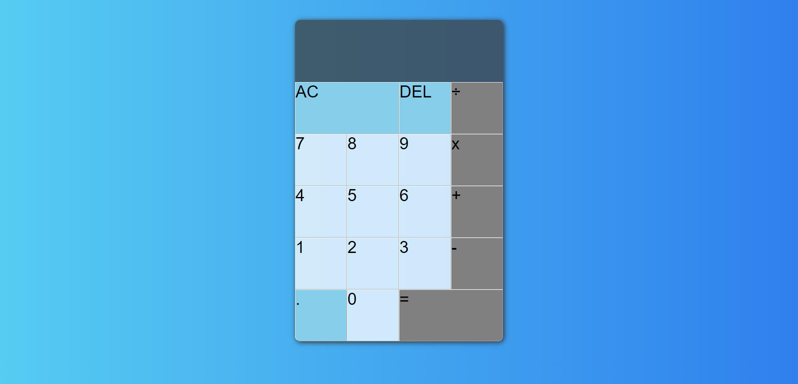

# React Calculator
Welcome to the React Calculator App! This application provides a user-friendly interface for performing basic arithmetic calculations. Built using React JS, it allows users to input numbers and operators to perform addition, subtraction, multiplication, and division operations.

## Overview
The React Calculator App is a simple yet powerful tool for performing calculations on the fly. It is designed to provide a smooth and intuitive user experience. With a clean interface and responsive design, users can easily input numbers and operators to obtain accurate results.

## Features
- Arithmetic operations: Addition, subtraction, multiplication, and division.
- User-friendly interface: Clear buttons, responsive design, and easy-to-use input.
- Real-time calculation: Instantly see the result as you input numbers and operators.

## Tech Stack
- Front-End: React JS
- Styling: CSS

## Key Features
- Real-time calculation: As users input numbers and operators, the calculator displays the result in real-time.
- Intuitive design: The interface is clean and straightforward, making it easy for users to perform calculations without confusion.

## Get Started
1. Clone this repository: `git clone https://github.com/Jaganath-MSJ/React-Calculator.git`
2. Navigate to the project directory: `cd React-Calculator`
3. Install dependencies: `npm install`
4. Start frontend: `npm start`
5. Open the app in your browser: `http://localhost:3000`

## Demo:
For a live demonstration, you can visit [Demo Link](https://msj-react-calculator.netlify.app).

## Contact:
Feel free to reach out to me via email at [jagan.msjc@gmail.com](mailto:jagan.msjc@gmail.com) or connect on [LinkedIn](https://www.linkedin.com/in/jaganathms).

## Thanks To
[Netlify](https://www.netlify.com)
